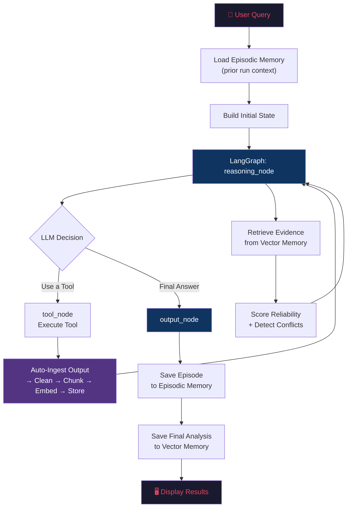

<p align="center">
  
</p>

<h1 align="center">ARA-1 — Autonomous Research Agent</h1>


<p align="center">
  <b>A retrieval-aware autonomous financial intelligence system built with LangGraph and the ReAct framework.</b>
</p>

<p align="center">
  
  
  
  
</p>

---

## 📌 What is ARA-1?

**ARA-1** is an autonomous AI agent that performs end-to-end financial research on publicly traded companies. Give it a ticker symbol or a research question, and it will:

- 🔍 **Dynamically select tools** to gather real-time stock data, financial metrics, company profiles, and news
- 🧠 **Reason step-by-step** using the ReAct (Reasoning + Acting) framework
- 📚 **Store & retrieve knowledge** from a persistent vector memory (ChromaDB)
- 📊 **Score source reliability** using a 3-tier evidence governance system
- ⚡ **Detect conflicting information** and surface it transparently
- 🗂️ **Learn from past analyses** through episodic memory

ARA-1 is **not** a chatbot wrapper. It is a fully autonomous agent that decides *what to do*, *when to do it*, and *when to stop* — all without human intervention.

---

## 🏗️ Architecture

ARA-1 is built on a **layered modular architecture** with clean separation of concerns:

```
┌─────────────────────────────────────────────────────────┐
│              main.py  ·  app.py  ·  api/                │  ← Entry points
├─────────────────────────────────────────────────────────┤
│              LangGraph StateGraph (agent/)              │  ← The ReAct loop
│         reasoning_node → tool_node → output_node        │
│         + state · prompts · react_parser                │
├──────────────────────────┬──────────────────────────────┤
│      Tool Layer          │      knowledge/              │
│      (tools/)            │                              │
│                          │  ingestion/   clean·chunk    │
│  • stock_price           │  retrieval/   store·search   │
│  • company_info          │  memory/      episodic       │
│  • financial_metrics     │  reliability/ tiers·staleness│
│  • news                  │               ·conflicts     │
├──────────────────────────┴──────────────────────────────┤
│                       analysis/                         │  ← Evidence → thesis
│   financial → sentiment → misalignment → risk →         │
│   confidence → report                                   │
├─────────────────────────────────────────────────────────┤
│                       quality/                          │  ← Observes only,
│   evaluation/ · observability/ · dashboard              │    never blocks a run
├─────────────────────────────────────────────────────────┤
│              config/  ·  utils/logger                   │  ← Support
└─────────────────────────────────────────────────────────┘

Data flows top to bottom. The graph only covers the ReAct loop —
analysis/ runs after it completes, on the finished state.
```

---

## ⚙️ How It Works — End-to-End Workflow



### Step-by-Step Breakdown

| Step | What Happens |
|------|-------------|
| **1. Query** | User provides a research question (e.g., *"Analyze NVDA stock"*) |
| **2. Episodic Recall** | Agent checks if it has analyzed this ticker before and loads prior experience |
| **3. Reasoning Loop** | LLM uses ReAct framework: **Thought** → **Action** → **Observation** → repeat |
| **4. Tool Execution** | Agent dynamically selects and calls tools (stock price, metrics, news, etc.) |
| **5. Auto-Ingestion** | Every tool output is automatically cleaned, chunked, embedded, and stored in ChromaDB |
| **6. Evidence Retrieval** | At each reasoning step, relevant evidence is semantically retrieved from vector memory |
| **7. Reliability Scoring** | Retrieved evidence is scored by source tier (Tier 1–3) with staleness decay |
| **8. Conflict Detection** | Contradictory evidence is flagged (numeric, sentiment, or temporal conflicts) |
| **9. Final Synthesis** | Agent produces a grounded analysis citing evidence with confidence scores |
| **10. Memory Update** | Episode saved for future learning; final analysis stored in vector memory |

---

## 🚀 Local Setup & Usage

### Prerequisites

- **Python 3.12+**
- **Git**
- At least one LLM API key: **Groq** (free), **OpenAI**, or **Anthropic**

### 1. Clone the Repository

```bash
git clone https://github.com/your-username/ara-agent.git
cd ara-agent
```

### 2. Create a Virtual Environment

```bash
# Windows
python -m venv .venv
.venv\Scripts\activate

# macOS / Linux
python3 -m venv .venv
source .venv/bin/activate
```

### 3. Install Dependencies

```bash
pip install -r requirements.txt
```

### 4. Configure Environment Variables

Copy the example config and add your API keys:

```bash
cp .env.example .env
```

Edit `.env` with your preferred editor:

```env
# ============================================================
# ARA-1 Environment Configuration
# ============================================================

# --- LLM Provider (pick one) ---
# Option A: Groq (FREE — recommended for getting started)
GROQ_API_KEY=your-groq-api-key-here
LLM_PROVIDER=groq
GROQ_MODEL=llama-3.3-70b-versatile

# Option B: OpenAI
# OPENAI_API_KEY=your-openai-api-key-here
# LLM_PROVIDER=openai
# OPENAI_MODEL=gpt-4o

# Option C: Anthropic
# ANTHROPIC_API_KEY=your-anthropic-api-key-here
# LLM_PROVIDER=claude
# ANTHROPIC_MODEL=claude-sonnet-4-20250514

# --- Agent Settings ---
MAX_ITERATIONS=10
LOG_LEVEL=INFO

# --- Phase 2: Embeddings (optional, enhances retrieval quality) ---
# OPENAI_API_KEY=your-openai-api-key-here
```

> **💡 Tip:** Get a free Groq API key at [console.groq.com](https://console.groq.com). No credit card required.

### 5. Run the Agent

**Interactive mode** (prompts for a query):

```bash
python main.py
```

**With a query argument:**

```bash
python main.py "Analyze Tesla stock as a long-term investment"
```

**More example queries:**

```bash
python main.py "What are the financial risks of investing in AAPL?"
python main.py "Compare NVDA and AMD financial performance"
python main.py "Provide a comprehensive analysis of Microsoft (MSFT)"
```

---

## 📂 Project Structure

```
ARA-1/
│
├── main.py                   # 🚀 CLI entry point & system assembly
├── app.py                    # 🖥️  Streamlit UI (the Hugging Face Space)
│
├── agent/                    # 🧠 The reasoning loop
│   ├── state.py              #    AgentState — the single source of truth
│   ├── graph.py              #    LangGraph wiring: 3 nodes, 1 loop
│   ├── nodes.py              #    reasoning → tool → output
│   ├── prompts.py            #    System prompt template + builders
│   ├── react_parser.py       #    LLM text → structured action (5 fallbacks)
│   ├── retry_handler.py      #    ⚠️ built, not wired
│   └── checkpoint_manager.py #    ⚠️ built, not wired
│
├── tools/                    # 🔧 Where all external data enters
│   ├── base.py               #    BaseTool — subclass this to add one
│   ├── registry.py           #    Register in main.py, that's the whole step
│   ├── stock_price.py        #    Price, day range, 52w range, volume
│   ├── company_info.py       #    Sector, industry, HQ, headcount
│   ├── financial_metrics.py  #    P/E, margins, ROE, growth, leverage
│   └── news.py               #    Recent headlines
│
├── knowledge/                # 📚 What the agent knows and how it recalls it
│   ├── ingestion/            #    Text in:  clean → chunk → embed → store
│   ├── retrieval/            #    Text out: vector store + semantic search
│   ├── memory/               #    What survives across runs (episodic.py)
│   └── reliability/          #    Source tiers, staleness, conflict detection
│
├── analysis/                 # 📊 Turning evidence into a thesis
│   ├── engine.py             #    Orchestrates the 6 stages below
│   ├── financial_engine.py   #    1. Score ~22 metrics against thresholds
│   ├── sentiment_analyzer.py #    2. Lexicon-based news sentiment
│   ├── misalignment_detector.py #  3. Does the story match the numbers?
│   ├── risk_analyzer.py      #    4. Valuation, leverage, volatility risks
│   ├── confidence_calibrator.py #  5. How much should we trust this?
│   ├── report_generator.py   #    6. Render Markdown + PDF
│   └── schemas.py            #    Pydantic models tying it together
│
├── quality/                  # 🔬 Did it do a good job? Can we see how?
│   ├── evaluation/           #    22 metrics + hallucination detection
│   ├── observability/        #    ⚠️ built, zero instrumentation call sites
│   └── dashboard.py          #    Read-only Streamlit monitor
│
├── api/server.py             # 🌐 FastAPI wrapper (POST /analyze)
├── config/settings.py        # ⚙️  Frozen settings singleton, reads .env
├── utils/logger.py           # 📋 Rich console + per-session file logging
│
├── data/                     # 💾 Runtime state (gitignored)
│   ├── chroma/               #    Vector database
│   ├── episodic/             #    One JSON per past run
│   └── evaluations/          #    Evaluation output
├── reports/                  # 📄 Generated analysis reports
├── logs/                     # 📄 Per-session logs
│
├── CLAUDE.md                 # 🧭 Architecture notes + known defects
├── plan.md                   # 🗺️  Roadmap (Phases 5–8)
├── requirements.txt
└── .env.example
```

### Where to start reading

Follow the data, in this order:

1. **`main.py`** — the assembly point. Everything is wired here and nowhere else.
2. **`agent/state.py`** — `AgentState` is what flows between every node. Read this before any node.
3. **`agent/graph.py`** — 3 nodes and one loop. Small file, whole control flow.
4. **`agent/nodes.py`** — where reasoning and tool execution actually happen.
5. **`tools/stock_price.py`** — the simplest tool; the shape all others follow.
6. **`analysis/engine.py`** — the 6-stage synthesis pipeline.

> **One thing that surprises everyone:** synthesis is **not** part of the graph. The graph is only the ReAct loop. `main.py` runs it to completion, then hands the finished state to `analysis/engine.py` as a separate step.

---

## 🧪 Example Output

```
┌─────────────────────────────────────────────────────────────┐
│  ARA-1 - Autonomous Research Agent                          │
│  Phase 2: Retrieval-Aware Financial Intelligence            │
└─────────────────────────────────────────────────────────────┘
[OK] Configuration valid
[OK] LLM Provider: groq (llama-3.3-70b-versatile)
[OK] Phase 2 systems initialized:
     Vector Store: chroma (4 existing docs)
     Embeddings: text-embedding-3-small
     Episodic Memory: 1 prior episodes

Starting analysis...
Query: Analyze NVDA stock performance
Max iterations: 10

  === Iteration 1/10 ===
  Thought: I need to gather NVDA's current stock price...
  >> Action: get_stock_price({'ticker': 'NVDA'})
  Ingested 1 chunk (total in store: 5)

  === Iteration 2/10 ===
  Retrieved 5 evidence items in 6.3ms
  Thought: Now I need financial metrics...
  >> Action: get_financial_metrics({'ticker': 'NVDA'})
  Ingested 1 chunk (total in store: 6)

  ...

┌──────────────────── [OK] Analysis Complete ─────────────────────┐
│                                                                  │
│  NVIDIA Corporation (NVDA) is a technology company operating     │
│  in the semiconductors industry. Current price: USD 224.65,     │
│  trailing P/E: 45.83, revenue growth: 73.20%, market cap:       │
│  $5.46T. Strong financial position with 55.60% profit margin.   │
│                                                                  │
└──────────────────────────────────────────────────────────────────┘

Tool Usage Summary:
┌───┬───────────────────────┬────────────────────┬────────┐
│ # │ Tool                  │ Input              │ Status │
├───┼───────────────────────┼────────────────────┼────────┤
│ 1 │ get_stock_price       │ {'ticker': 'NVDA'} │ OK     │
│ 2 │ get_financial_metrics │ {'ticker': 'NVDA'} │ OK     │
│ 3 │ get_company_info      │ {'ticker': 'NVDA'} │ OK     │
└───┴───────────────────────┴────────────────────┴────────┘

Memory Operations:
  📦 ingested:get_stock_price:NVDA:1chunks
  📦 ingested:get_financial_metrics:NVDA:1chunks
  📦 ingested:get_company_info:NVDA:1chunks
```

---

## 🔌 Adding Custom Tools

ARA-1's tool system is fully extensible. To add a new tool:

**1. Create a new file** in `tools/`:

```python
# tools/my_custom_tool.py
from tools.base import BaseTool, ToolResult

class MyCustomTool(BaseTool):
    @property
    def name(self) -> str:
        return "my_custom_tool"

    @property
    def description(self) -> str:
        return "Description of what this tool does"

    @property
    def parameters(self) -> dict:
        return {
            "param1": {"type": "string", "description": "What this param is", "required": True}
        }

    def execute(self, **kwargs) -> ToolResult:
        param1 = kwargs.get("param1", "")
        # Your logic here
        result = f"Result for {param1}"
        return ToolResult(success=True, data=result)
```

**2. Register it** in `main.py`:

```python
from tools.my_custom_tool import MyCustomTool

def create_tool_registry() -> ToolRegistry:
    registry = ToolRegistry()
    # ... existing tools ...
    registry.register(MyCustomTool())  # ← Add this line
    return registry
```

That's it. The agent will automatically discover and use your tool when relevant.

---

## 🔑 Supported LLM Providers

| Provider | Model | Free? | Configuration |
|----------|-------|-------|---------------|
| **Groq** | `llama-3.3-70b-versatile` | ✅ Yes | `LLM_PROVIDER=groq` |
| **OpenAI** | `gpt-4o` | ❌ Paid | `LLM_PROVIDER=openai` |
| **Anthropic** | `claude-sonnet-4-20250514` | ❌ Paid | `LLM_PROVIDER=claude` |

> **Recommendation:** Start with **Groq** — it's free, fast, and the `llama-3.3-70b-versatile` model works excellently with ARA-1's ReAct prompts.

---

## 🛡️ Source Reliability Tiers

ARA-1 doesn't treat all information equally. Every piece of evidence is scored:

| Tier | Score Range | Sources | Examples |
|------|------------|---------|----------|
| **Tier 1** | 0.85 – 1.0 | Official/Primary | SEC filings, exchange data, tool API outputs |
| **Tier 2** | 0.60 – 0.84 | Established Media | Reuters, Bloomberg, Yahoo Finance, WSJ |
| **Tier 3** | 0.30 – 0.59 | Secondary/Informal | Seeking Alpha, Reddit, blogs, social media |

Scores also decay over time — a stock price from last week is less reliable than one from today.

---

## 📊 Phase Progression

| Phase | Status | Description |
|-------|--------|-------------|
| **Phase 1** | ✅ Shipped | ReAct loop, tool registry, 5-strategy JSON parser, session logging |
| **Phase 2** | ✅ Shipped | Chroma vector store, semantic retrieval, reliability scoring, episodic memory |
| **Phase 3** | ✅ Shipped | 6-stage deterministic synthesis DAG → BUY/HOLD/SELL thesis + Markdown/PDF reports |
| **Phase 4** | ✅ Shipped | 22-metric evaluation, observability (telemetry + tracing), FastAPI backend, Streamlit UI |
| **Phase 5** | ✅ Shipped | Data-integrity + honest-confidence pass: D1–D12 closed, structured tool payloads (canonical units), abstain gate below 8 metrics |
| **Phase 6** | ✅ Shipped | Short/medium/long horizons that re-weight synthesis, 2-year price series, technical engine, market-context tool, dated + falsifiable recommendations with an invalidation condition, append-only recommendation log |
| **Phase 7** | 🔨 Partial | Real multi-source evidence: SEC EDGAR `companyfacts` tool, PDF ingestion (10-K/10-Q, no OCR), earnings-transcript ingestion, insider-transactions tool (3rd source family). The conflict-driven reroute into the financial engine (7.4) is not built |
| **Phase 8** | 🔨 Mechanism shipped, not yet exercised | Outcome scoring (re-fetches price at review date, grades hit rate + Brier), technical-only rolling backtester, volatility-scaled position sizing, empirical confidence recalibration from graded outcomes. No recommendation has reached its review date yet, so the gate is not closed |

---

## 🧰 Tech Stack

| Component | Technology |
|-----------|-----------|
| **Agent Framework** | LangGraph (StateGraph) |
| **Reasoning** | ReAct (Reason + Act) |
| **LLM Interface** | LangChain Core |
| **Vector Database** | ChromaDB |
| **Embeddings** | OpenAI text-embedding-3-small |
| **Financial Data** | yfinance |
| **Data Validation** | Pydantic v2 |
| **CLI / Display** | Rich |
| **Logging** | Python logging + Rich |
| **Config** | python-dotenv |

---

## 🤝 Contributing

1. Fork the repository
2. Create a feature branch (`git checkout -b feature/new-tool`)
3. Commit your changes (`git commit -m 'Add SEC filing tool'`)
4. Push to the branch (`git push origin feature/new-tool`)
5. Open a Pull Request

---

## 📜 License

This project is for educational and research purposes. 

---

<p align="center">
  <b>Built with ❤️ by Shubham</b><br/>
  <i>ARA Agent-- Any feedback is appreciated.</i>
</p>
